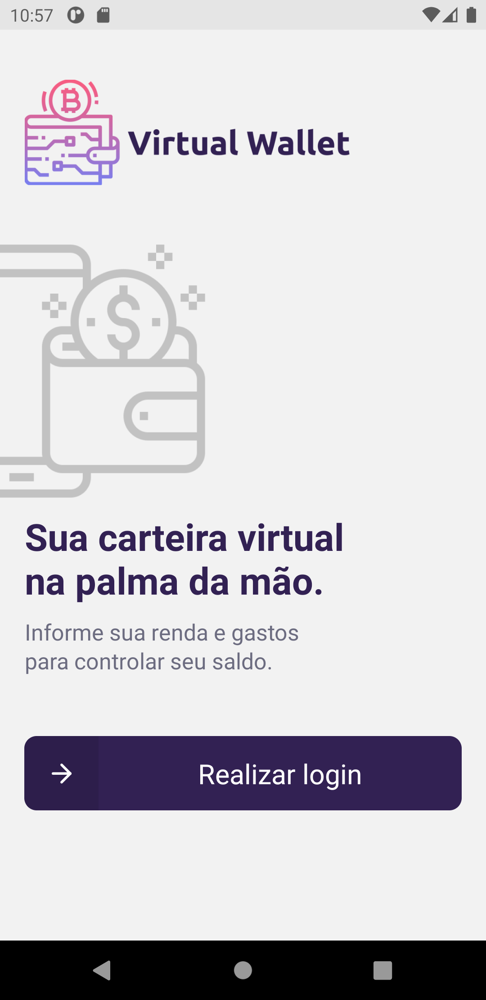
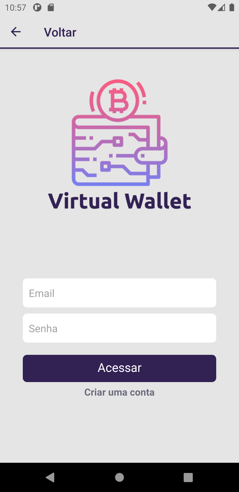
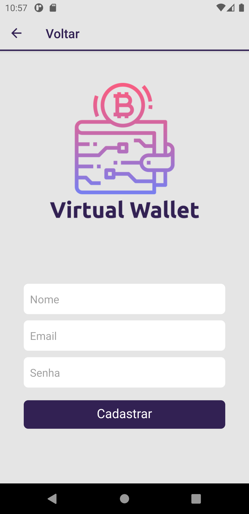
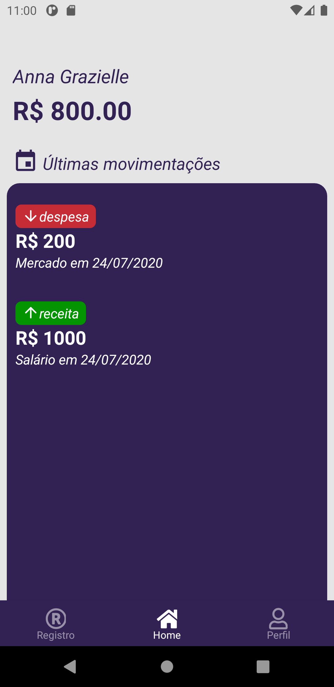
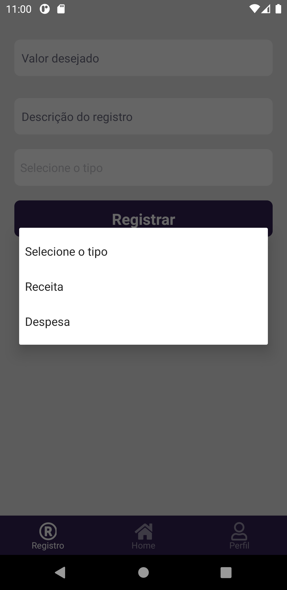
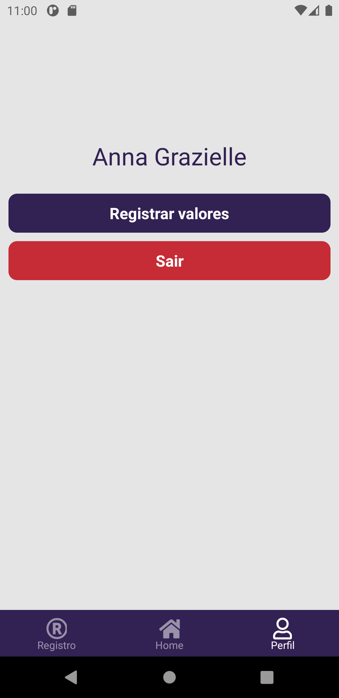

<p align="center">
   
</p>


> :rocket: Projeto feito para ajudar pessoas a controlarem seus gastos registrando em um aplicativo, feito por Anna Grazielle.

# :pushpin: Tabela de Conteúdo

* [Tecnologias](#computer-tecnologias)
* [Funcionalidades](#rocket-funcionalidades)
* [Como rodar](#construction_worker-como-rodar)
* [Licença](#closed_book-license)

### Mobile Screenshot
<div style="display: flex; flex-direction: 'row';">
   
   
   
</div>

<div style="display: flex; flex-direction: 'row';">
   
   
   
</div>

# :computer: Tecnologias
Esse projeto foi desenvolvido utilizando as seguintes tecnologias:

* [JavaScript](https://www.javascript.com/)      
* [React Native](https://reactnative.dev/)      
* [Android Studio](https://developer.android.com/studio)       
* [Firebase](https://firebase.google.com/?hl=pt) 

# :rocket: Funcionalidades

* Aplicativo para organização pessoal financeira.

# :construction_worker: Como rodar
```bash
# Clone o Repositório
$ git clone https://github.com/grazielleanna/VirtualWallet.git
```

### 📱 Rode o Aplicativo
Para rodar o aplicativo você precisa de um emulador Android/IOS.

```bash
# Vá para a pasta
$ cd App

# Instale as dependências
$ npm install

# Rode a aplicação
$ react-native run-android
```

# :closed_book: Licença

Lançado em 2020 :closed_book:

Feito com carinho por [Anna Grazielle](https://github.com/grazielleanna) 🚀.
